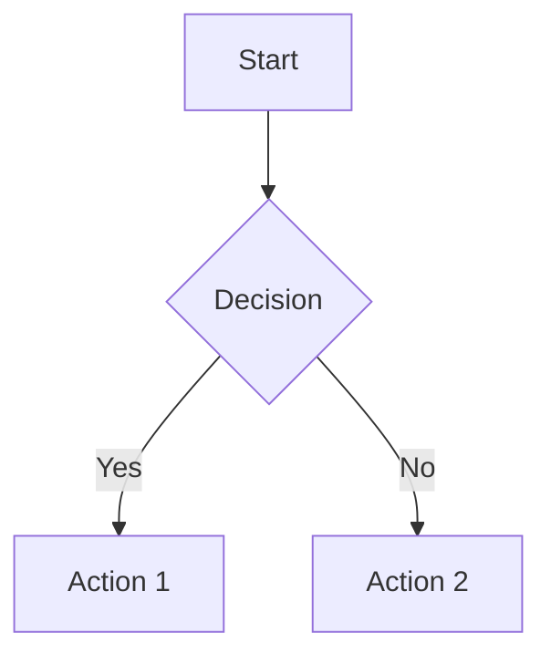

# NoteMaster v1.5.0 Release Notes

## 🎉 Major Release: Collaboration & Media Features

**Release Date:** November 13, 2025  
**Version:** 1.5.0 (upgraded from 0.1.0)

---

## 🚀 What's New

### 1. 🔗 Share Links & Public Notes

Transform NoteMaster into a collaboration platform with public sharing:

- **Public Share Links**: Generate shareable URLs for any note
- **Expiration Options**: Set links to expire after 1, 7, 30, or 90 days (or never)
- **Public Note Viewer**: Beautiful, read-only interface at `/shared/[token]`
- **Copy to Clipboard**: One-click link copying
- **Share Button**: New purple "🔗 Share" button in note toolbar
- **Command Palette**: Access sharing via Ctrl+P → "Share Note"

**How to use:**
1. Open any note
2. Click "🔗 Share" in the toolbar
3. Choose expiration (optional)
4. Click "Generate Share Link"
5. Copy and share the URL!

### 2. 📚 Version Control System

Never lose work again with automatic version tracking:

- **Automatic Snapshots**: Versions created on title/content changes
- **Version History**: View all past versions with metadata
- **One-Click Restore**: Restore any previous version
- **Version Limit**: Keeps last 50 versions per note
- **Version Metadata**: See title, tags, notebook, and timestamp
- **API Endpoints**: Full REST API for version management

**How to use:**
1. Edit a note (versions save automatically)
2. Click "📚 History" to view versions
3. Click "Restore" on any version to revert

### 3. 📧 Email Invitations

Share notes directly via email:

- **Email Integration**: Send share links to colleagues
- **Personal Messages**: Add custom notes to invitations
- **Email Templates**: Professional, branded emails
- **Ready for Production**: Easy integration with SendGrid/Nodemailer

**How to use:**
1. Generate a share link
2. Enter recipient email
3. Add optional personal message
4. Click "📧 Send Email Invitation"

### 4. 🎨 Media & Rich Content

Professional documentation features:

**Video Embeds** 🎥
- YouTube and Vimeo support
- Custom toolbar button
- One-click embed insertion

**LaTeX Math** ∑
- Inline math: `$E = mc^2$`
- Block math equations
- Full KaTeX rendering
- Math toolbar button

**Mermaid Diagrams** 📊
- Flowcharts
- Sequence diagrams
- Gantt charts
- Pie charts
- Class diagrams
- State diagrams
- ER diagrams
- Diagram toolbar button with templates

**Enhanced Code Blocks** 💻
- Syntax highlighting
- Multiple language support
- Better code rendering

---

## 📦 New Components

### ShareDialog
`src/components/ShareDialog.tsx`
- Full-featured sharing modal
- Link generation with expiration
- Email invitation form
- Copy-to-clipboard functionality

### MediaRichEditor
`src/components/MediaRichEditor.tsx`
- Enhanced markdown editor
- Video embed command
- LaTeX math command
- Mermaid diagram command with templates
- Full syntax highlighting

### Public Note Viewer
`src/app/shared/[token]/page.tsx`
- Clean, read-only interface
- Responsive design
- Note metadata display
- Call-to-action for NoteMaster

---

## 🔌 API Endpoints

### Share Links
```
POST   /api/notes/[id]/share         - Generate share link
DELETE /api/notes/[id]/share         - Revoke share link
POST   /api/notes/[id]/share/email   - Send email invitation
GET    /api/shared/[token]           - Fetch shared note
```

### Version Control
```
GET    /api/notes/[id]/versions              - List all versions
POST   /api/notes/[id]/versions              - Create version snapshot
POST   /api/notes/[id]/versions/[versionId]  - Restore specific version
```

---

## 📚 Dependencies Added

```json
{
  "katex": "^0.16.9",           // LaTeX rendering
  "mermaid": "^10.6.1",         // Diagram rendering
  "rehype-katex": "^7.0.0",     // Markdown math plugin
  "remark-math": "^6.0.0"       // Markdown math parser
}
```

---

## 🎯 Usage Examples

### Sharing a Note
```typescript
// Generate share link with 7-day expiration
const shareLink = await generateShareLink(noteId, { expiresIn: 7 });

// Send via email
await sendEmailInvitation(shareLink, {
  email: 'colleague@example.com',
  message: 'Check out my project notes!'
});
```

### LaTeX Math
```markdown
Inline: $E = mc^2$

Block:
$$
\int_{-\infty}^{\infty} e^{-x^2} dx = \sqrt{\pi}
$$
```

### Mermaid Diagrams
````markdown

````

### Video Embeds
```html
<!-- YouTube -->
<iframe width="560" height="315" src="https://www.youtube.com/embed/VIDEO_ID"></iframe>

<!-- Vimeo -->
<iframe src="https://player.vimeo.com/video/VIDEO_ID" width="640" height="360"></iframe>
```

---

## 🔧 Technical Details

### Version Control Implementation
- Versions stored in-memory (Map structure)
- Automatic snapshot on content/title changes
- 50-version limit per note (oldest removed)
- Timestamp-based version IDs
- Full metadata preservation

### Share Link Security
- Cryptographically secure tokens (32-byte random)
- Optional expiration (1-90 days)
- Expired links automatically purged
- Read-only access for shared notes

### Media Rendering
- Server-side Mermaid rendering
- Client-side KaTeX for math
- Syntax highlighting via lowlight
- Responsive iframe embeds

---

## 🎨 UI Improvements

- **Share Button**: Purple button in note toolbar
- **Version History Modal**: Enhanced with API loading
- **Public Note Page**: Professional sharing experience
- **Media Toolbar**: Video, Math, and Diagram buttons
- **Command Palette**: New "Share Note" command

---

## 🔮 Future Enhancements

From TODO.md, upcoming features:
- Real-time collaborative editing
- Comments system
- Public/private toggle
- Share permissions (view/edit/admin)
- Activity feed
- Audio recording
- PDF viewer inline
- Image annotations
- Advanced table editor

---

## 📖 Documentation

All features documented in:
- `TODO.md` - Updated with completed features
- `README.md` - Installation and usage guide
- `INSTALL.md` - Deployment instructions
- `UPDATE.md` - Update procedures
- `DOCKER.md` - Containerization guide

---

## 🙏 Credits

**NoteMaster v1.5.0**  
A modern, powerful note-taking application  
Built with Next.js, React, TypeScript, Tailwind CSS, and Prisma

---

## 🐛 Known Issues

- Share links stored in-memory (use database in production)
- Versions stored in-memory (use database in production)
- Email service requires integration (SendGrid/Nodemailer)
- Mermaid diagrams require page refresh to render initially

---

## 📝 Upgrade Instructions

1. Pull latest changes: `git pull origin master`
2. Install new dependencies: `npm install`
3. Build application: `npm run build`
4. Restart server: `pm2 restart notemaster`

---

**Version 1.5.0 represents a major milestone in NoteMaster's evolution from a personal note-taking app to a collaborative documentation platform!** 🎉
